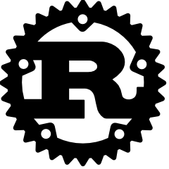

% The Rust Programming Language
% G.D. Ritter
% June 2015

# The Rust Programming Language

A new systems programming language being developed by Mozilla Research, with
an emphasis on correctness while still allowing for very low-level programing
by emphasizing _zero-cost abstractions_.

# Low-Level Programming

# Low-Level Programming

\begin{center}
\includegraphics[width=.9\textwidth]{imgs/kanye-water-bottle-01.png}
\end{center}

# Low-Level Programming

\begin{center}
\includegraphics[width=.9\textwidth]{imgs/kanye-water-bottle-02.png}
\end{center}

# Systems Programming Languages

> System software is computer software designed to operate and control the
> computer hardware and to provide a platform for running application
> software, and includes such things as operating systems, utility software,
> device drivers, compilers, and linkers.
>
> —Wikipedia

> "Systems programs" means "programs where the constant factors are important".
>
> —Comment by `neelk` on Lambda the Ultimate

# Systems Programming Languages

## Example Program

A program that:

- Defines a `point` struct.
- Gives that `point` struct two machine integers as
  fields.
- Defines an `add` function that takes and returns
  two `point`s _by value_.
- Has a `main` function that:
    - Creates a `point` on the stack
    - Creates a `point` on the heap
    - Adds the two (after dereferencing the second)
    - Prints the result
    - Frees the second point

# Systems Programming Languages

## C

~~~~{.c}
typedef struct { int x, y; } point;

point add(point a, point b) {
  point result = { a.x + b.x, a.y + b.y };
  return result;
}

void main(int argc, char* argv[]) {
  point a = { 1, 2 };
  point* b = malloc(sizeof(point));
  b->x = 4; b->y = 3;
  point c = add(a, *b);
  printf("{.x = %d, .y = %d}\n", c.x, c.y);
  free(b);
}
~~~~

# Systems Programming Languages

## C++

~~~~{.cpp}
struct point {
  int x, y;
  point(int _x, int _y) { x = _x; y = _y; }
  point add(point other) {
    return point(x + other.x, y + other.y);
  }
};
int main(int argc, char* argv[]) {
  point a(1, 2);
  point* b = new point(4, 3);
  point c = a.add(*b);
  cout << "{ .x = " << c.x;
  cout << ", .y = " << c.y << " }" << endl;
  delete b;
}
~~~~

# Systems Programming Languages

## Go

~~~~{.go}
type Point struct { X, Y int }

func (a Point) add(b Point) Point {
    return Point{ a.X + b.X, a.Y + b.Y }
}

func main() {
    a := Point{1, 2}
    b := new(Point)
    b.X, b.Y = 4, 3
    fmt.Println(a.add(*b))
    // No free, because Go is garbage-collected
}
~~~~

# Systems Programming Languages

## D

~~~~{.d}
struct Point {
  int x, y;
  Point add(Point other) {
    return Point(this.x + other.x, this.y + other.y);
  }
}

void main() {
  Point a = Point(1, 2);
  Point* b = cast(Point*)GC.malloc(Point.sizeof);
  b.x = 4; b.y = 3;
  writeln(a.add(*b));
  GC.free(b);
}
~~~~

# Systems Programming Languages

## Nim

~~~~
type Point = tuple[x: int, y: int]

proc add(a: Point, b: Point): Point =
  (x: a.x + b.x, y: a.y + b.y)

var a : Point
var b : ptr Point

a = (x: 1, y: 2)
b = cast[ptr Point](alloc(sizeof(Point)))
b.x = 4
b.y = 3
echo(add(a, b[]))
dealloc(b)
~~~~

# Systems Programming Languages

## Rust

~~~~{.rust}
#[derive(Debug,Clone,Copy)]
struct Point { x: isize, y: isize }

fn add(l: Point, r: Point) -> Point {
    Point { x: l.x + r.x, y: l.y + r.y }
}

fn main() {
    let a = Point { x: 1, y: 2 };
    let b = Box::new(Point { x: 4, y: 3 });
    println!("{:?}", add(a, *b));
}
~~~~

# What Makes Rust Interesting

## Ownership

\begin{center}
\includegraphics[width=.9\textwidth]{imgs/dawkins-owned.png}
\end{center}

# Preliminary Zero
## Mutability

~~~~{.rust}
fn factorial(n: usize) -> usize {
  let result = 1;
  while n > 0 {
    result *= n;
    n -= 1;
  }
  result
}
~~~~

# Preliminary Zero
## Mutability is NOT THE DEFAULT

~~~~{.rust}
fn factorial(n: usize) -> usize {
  let result = 1;
  while n > 0 {
    result *= n;  /* ERROR */
    n -= 1;       /* ERROR */
  }
  result
}
~~~~

# Preliminary Zero
## Mutability is Opt-In

~~~~{.rust}
fn factorial(mut n: usize) -> usize {
  let mut result = 1;
  while n > 0 {
    result *= n;
    n -= 1;
  }
  result
}
~~~~

# Preliminary One
## Polymorphism (although not on this slide)

~~~~{.rust}
fn i32_id(a: i32) -> i32 {
  a
}

fn make_i32_pair(left: i32, right: i32) -> (i32, i32) {
  (left, right)
}
~~~~

# Preliminary One
## Polymorphism (this slide is, like, _totally_ polymorphic)

~~~~{.rust}
fn id<T>(a: T) -> T {
  a
}

fn make_pair<A, B>(left: A, right: B) -> (A, B) {
  (left, right)
}
~~~~

# Preliminary Two
## Traits

~~~~{.rust}
struct MyNum { num: i32 }

trait Sayable {
  fn say(&self);
}

impl Sayable for MyNum {
  fn say(&self) {
    println!(".oO( MyNum {{ num: {:?} }} )", self.num);
  }
}
~~~~

# Preliminary Two
## Traits

~~~~{.rust}
fn main() {
  (MyNum { num: 3 }).say();
}
~~~~

## Output
~~~~
.oO( MyNum { num: 3 } )
~~~~

# Preliminary Three
## Traits _and_ Polymorphism

~~~~{.rust}
fn say_twice<T: Sayable>(t: T) {
  t.say(); t.say();
}

fn main() {
  say_twice(MyNum { num: 7 });
}
~~~~

## Output
~~~~
.oO( NyNum { num: 7 } )
.oO( NyNum { num: 7 } )
~~~~

# Preliminary Three
## Traits _and_ Polymorphism

~~~~{.rust}
fn print_eq<A: Eq + Sayable>(left: A, right: A) {
  if left == right {
    println!("these are equal:");
    left.say();
    right.say();
  } else {
    println!("these are not equal:");
    left.say();
    right.say();
  }
}
~~~~

# Preliminary Four
## Built-In Traits

~~~~{.rust}
/* slightly simplified from the real definition */
trait PartialEq {
  fn eq(&self, other: &Self) -> bool;
  fn ne(&self, other: &Self) -> bool;
}

/* no more methods, but more laws */
trait Eq: PartialEq { }
~~~~

# Preliminary Four
## Implementing Built-In Traits

~~~~{.rust}
struct MyNum { num: i32 }

impl PartialEq for MyNum {
  fn eq(&self, other: &MyNum) -> bool {
    self.num == other.num
  }
}

impl Eq for MyNum { }
~~~~

# Preliminary Four
## Implementing Built-In Traits Automatically

~~~~{.rust}
/* or just this */
#[derive(PartialEq,Eq)]
struct MyNum { num: i32 }
~~~~

# Preliminary Four
## Format-String-Related Traits

~~~~{.rust}
/* in the stdlib: */
trait Debug {
  fn fmt(&self, &mut Formatter) -> Result;
}

/* so, on on our type: */
#[derive(Debug)]
struct MyNum { num: i32 }
~~~~

# What Makes Rust Interesting
## Ownership

~~~~{.rust}
#[derive(Debug)]
struct MyNum { num: i32 }

fn main() {
  let x = MyNum { num: 2 };

  println!("x = {:?}", x);
  /* prints "x = MyNum { num: 2 }" */
}
~~~~

# What Makes Rust Interesting

## Ownership

~~~~{.rust}
#[derive(Debug)]
struct MyNum { num: i32 }

fn main() {
  let x = MyNum { num: 2 };
  let y = x;
  println!("x = {:?}", x);
  /* doesn't compile */
}
~~~~

# What Makes Rust Interesting

## Ownership

~~~~{.rust}
#[derive(Debug)]
struct MyNum { num: i32 }

fn main() {
  let x = MyNum { num: 2 };
  let y = x; /* <- value moves here */
  println!("x = {:?}", x);

}
~~~~

# What Makes Rust Interesting

## Ownership

~~~~{.rust}
#[derive(Debug)]
struct MyNum { num: i32 }

fn main() {
  let x = MyNum { num: 2 };
  let y = x;
  println!("x = {:?}", x);
  /* so it does not live until the print */
}
~~~~

# What Makes Rust Interesting

## Ownership --- Explicit Cloning

~~~~{.rust}
#[derive(Debug, Clone)]
struct MyNum { num: i32 }

fn main() {
  let x = MyNum { num: 2 };
  let y = x.clone(); /* explicit clone */
  println!("x = {:?}", x);
  /* but this works! */
}
~~~~

# What Makes Rust Interesting

## Ownership --- Implicit Copying

~~~~{.rust}
#[derive(Debug, Clone, Copy)]
struct MyNum { num: i32 }

fn main() {
  let x = MyNum { num: 2 };
  let y = x; /* implicit copy */
  println!("x = {:?}", x);
  /* as does this! */
}
~~~~

# What Makes Rust Interesting

## Ownership --- Destructors

~~~~{.rust}
#[derive(Debug)]
struct MyNum { num: i32 }

impl Drop for MyNum {
  fn drop(&mut self) {
    println!("dropping: {:?}", self)
  }
}

fn main() {
  let x = MyNum { num: 2 };
  println!("x = {:?}", x);
}
~~~~

# What Makes Rust Interesting

## Ownership --- Destructors

~~~~{.rust}
fn main() {
  let x = MyNum { num: 2 };
  println!("x = {:?}", x);
}
~~~~

## Output

~~~~
x = MyNum { num: 2 }
dropping: MyNum { num: 2 }
~~~~

# What Makes Rust Interesting

## Ownership --- Special Clones

~~~~{.rust}
#[derive(Debug)]
struct MyNum { num: i32 }

impl Clone for MyNum {
  fn clone(&self) -> Self {
    println!("Cloning a MyNum...");
    MyNum { num: self.num }
  }
}

fn main() {
  let x = MyNum { num: 2 };
  let y = x.clone();
  println!("x = {:?}", x);
}
~~~~

## Ownership --- Special Clones

~~~~{.rust}
fn main() {
  let x = MyNum { num: 2 };
  let y = x.clone()
  println!("x = {:?}", x);
}
~~~~

## Output

~~~~
Cloning a MyNum...
x = MyNum { num: 2 }
~~~~

# What Makes Rust Interesting
## Owned Pointers --- "Boxes"

~~~~{.rust}
fn main() {

  let x = Box::new(5);

  println!("x + 1 = {:?}", *x + 1);

}
~~~~

# What Makes Rust Interesting
## Owned Pointers --- "Boxes"

~~~~{.rust}
fn main() {
  /* this acts like a `malloc` */
  let x = Box::new(5);
  /* this dereferences the pointer */
  println!("x + 1 = {:?}", *x + 1);
  /* as soon as ownership passes out
   * of scope, the box is freed */
}
~~~~

# What Makes Rust Interesting

## References

\begin{center}
\includegraphics[width=.9\textwidth]{imgs/dril-owned.png}
\end{center}

# What Makes Rust Interesting

## References

~~~~{.rust}
#[derive(Debug)]
struct MyNum { num: i32 }

fn some_func(_: MyNum) {
  println!("yeah, whatevs");
}

fn main() {
  let x = MyNum { num: 2 };
  some_func(x);
  println("{:?}", x);

}
~~~~

# What Makes Rust Interesting

## References

~~~~{.rust}
#[derive(Debug)]
struct MyNum { num: i32 }

fn some_func(_: MyNum) {
  println!("yeah, whatevs");
}

fn main() {
  let x = MyNum { num: 2 };
  some_func(x);
  println("{:?}", x);
  /* ERROR: use of moved value */
}
~~~~

# What Makes Rust Interesting

## References

~~~~{.rust}
#[derive(Debug)]
struct MyNum { num: i32 }

fn some_func(_: MyNum) -> MyNum {
  println!("yeah, whatevs");
}

fn main() {
  let x = MyNum { num: 2 };
  let y = some_func(x.clone());
  println("{:?}", y);
  /* works---but so tedious! */
}
~~~~

# What Makes Rust Interesting

## References

~~~~{.rust}
#[derive(Debug,Clone)]
struct MyNum { num: i32 }

fn some_func(_: MyNum) {
  println!("yeah, whatevs");
}

fn main() {
  let x = MyNum { num: 2 };
  some_func(x.clone());
  println("{:?}", x);
  /* works---but not what we want */
}
~~~~

# What Makes Rust Interesting

## References

~~~~{.rust}
#[derive(Debug)]
struct MyNum { num: i32 }

fn some_func(_: &MyNum)  {
  println!("yeah, whatevs");
}

fn main() {
  let x = MyNum { num: 2 };
  some_func(&x);
  println("{:?}", x);
  /* works! */
}
~~~~

# What Makes Rust Interesting

## Dangling References...?

~~~~{.rust}
fn main() {
  let mut my_ref: &i32 = &5;
  {
    let x = 7;
    my_ref = &x;
  }
  println!("{:?}", my_ref);
}
~~~~

# What Makes Rust Interesting

## Dangling References... are statically prevented

~~~~{.rust}
fn main() {
  let mut my_ref: &i32 = &5;
  {
    let x = 7;
    my_ref = &x; /* ERROR: does not live long enough */
  }
  println!("{:?}", my_ref);
}
~~~~

# What Makes Rust Interesting

## "The Borrow Checker"

~~~~{.rust}
fn main() {
  let mut my_vec = vec![];
  {
    let x = 7;
    my_vec.push(&x); /* also a problem */
  }
  println!("{:?}", my_vec);
}
~~~~

# What Makes Rust Interesting

## Lifetime Quandary

~~~~{.rust}
fn keep_left<T>(left: &T, right: &T) -> &T {
  left
}
~~~~

# What Makes Rust Interesting

## Lifetime Quandary

~~~~{.rust}
fn keep_left<'l, 'r, T>(left: &l T,
                        right: &r T) -> &l T {
  left
}
~~~~

# A Slightly Longer Example

## A Linked List

~~~~{.rust}
#[derive(Debug)]
enum List<T> {
  Cons(T, Box<List<T>>),
  Nil,
}

fn cons<T>(car: T, cdr: List<T>) -> List<T> {
  List::Cons(car, Box::new(cdr))
}

fn nil<T>() -> List<T> {
  List::Nil
}
~~~~

# A Slightly Longer Example

## A Linked List

~~~~{.rust}
fn head<T>(list: &List<T>) -> Option<&T> {
  match *list {
    Nil => None,
    Cons(ref x, _) => Some(&x),
  }
}
~~~~

# A Slightly Longer Example

## A Linked List Lifetime

~~~~{.rust}
fn main() {
  let mut h = None;
  {
    let lst = cons("this",
                cons("that",
                  cons("the other",
                    nil())));
    h = head(lst);
  }
  println!("{:?}", h);
}
~~~~

# A Slightly Longer Example

## Linked List: A Lifetime Original Picture

~~~~{.rust}
fn head<'a, T>(list: &'a List<T>) -> Option<&'a T> {
  match *list {
    Nil => None,
    Cons(ref x, _) => Some(&x),
  }
}
~~~~

# A Slightly Longer Example

## Linked List: A Lifetime Original Picture

~~~~{.rust}
fn polycephaly<T>(left: &List<T>, right: &List<T>)
  -> Option<(&T, &T)> {
  match (*left, *right) {
    (List::Nil, List::Nil) => None,
    (List::Cons(ref x, _),
     List::Cons(ref y, _)) => Some(y, x)
  }
}
~~~~

# A Slightly Longer Example

## You May Find Yourself Living in a Shotgun Shack

~~~~{.rust}
fn polycephaly<'l, 'r, T>(left: &'l List<T>,
                          right: &'r List<T>)
  -> Option<(&'r T, &'l T)> {
    match *left {
        List::Cons(ref x, _) => match *right {
            List::Cons(ref y, _) => Some((y, x)),
            _ => None,
        },
        _ => None,
    }
}
~~~~
